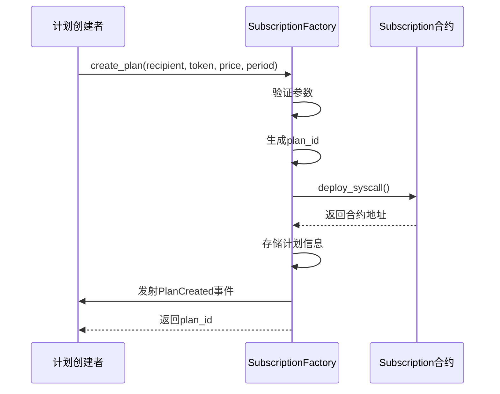
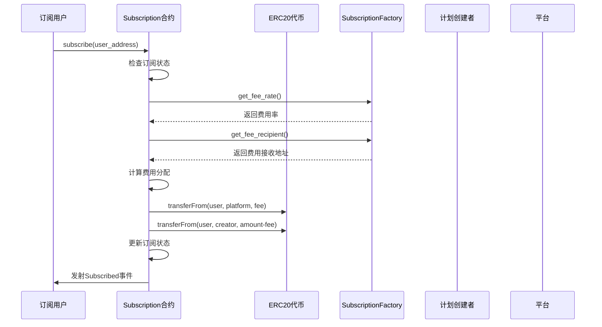
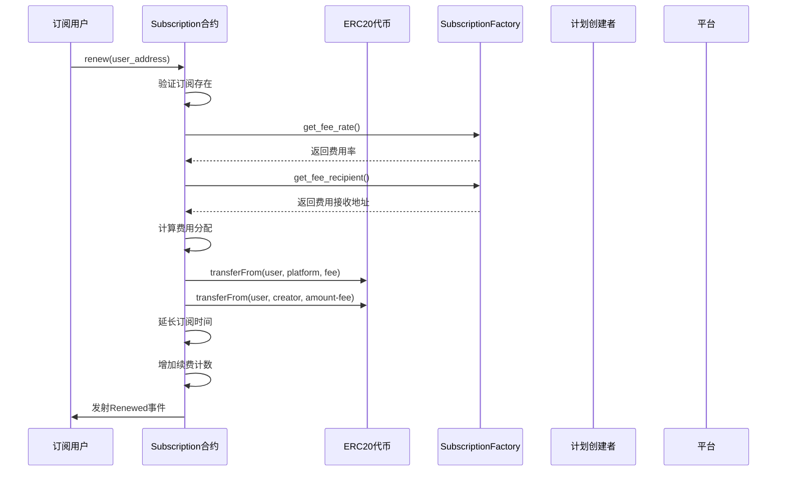
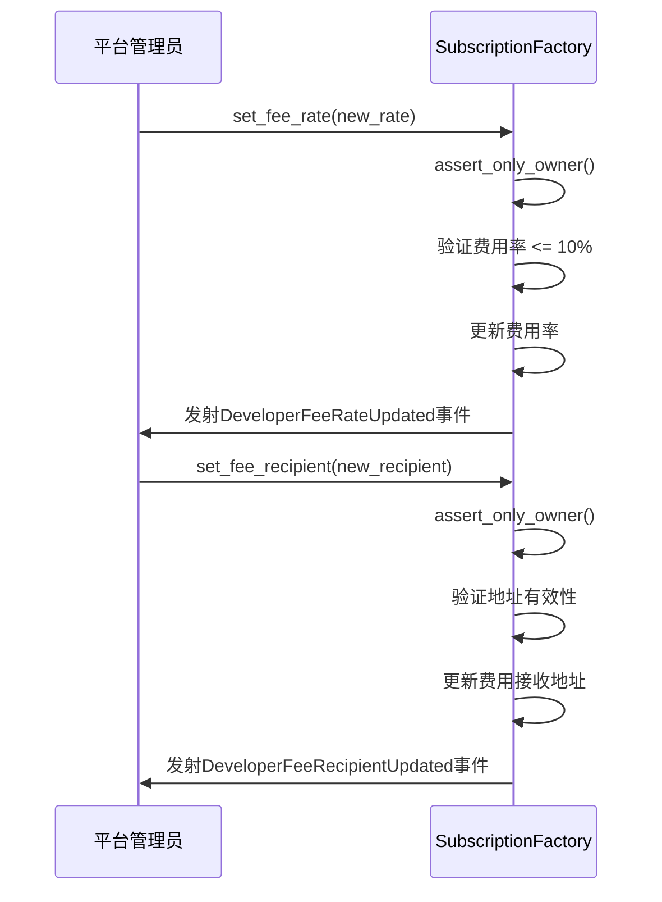

# Subra 订阅平台智能合约说明文档

## 概述

Subra 是一个基于 Starknet 的去中心化订阅平台，允许用户创建和管理订阅计划。平台由两个核心智能合约组成：`SubscriptionFactory`（订阅工厂合约）和 `Subscription`（订阅合约）。

## 合约架构

### 1. SubscriptionFactory（订阅工厂合约）

**主要功能：**
- 创建和管理订阅计划
- 部署独立的订阅合约
- 管理平台费用
- 提供批量查询功能

**核心组件：**
- OpenZeppelin Ownable：所有权管理
- OpenZeppelin Pausable：紧急暂停功能
- OpenZeppelin ReentrancyGuard：重入攻击防护
- OpenZeppelin Nonces：防重放攻击

### 2. Subscription（订阅合约）

**主要功能：**
- 处理用户订阅和续费
- 管理订阅状态
- 自动计算和分配费用

**核心组件：**
- OpenZeppelin Ownable：所有权管理
- OpenZeppelin Pausable：紧急暂停功能
- OpenZeppelin ReentrancyGuard：重入攻击防护

## 数据结构

### SubscriptionPlan（订阅计划）
```cairo
struct SubscriptionPlan {
    id: u256,                    // 计划ID
    recipient: ContractAddress,  // 收款地址
    token: ContractAddress,      // 支付代币地址
    price: u256,                 // 订阅价格
    period_length: u64,          // 订阅周期（秒）
    contract_address: ContractAddress, // 订阅合约地址
    is_active: bool,             // 是否激活
    created_at: u64,             // 创建时间
    total_subscribers: u32,      // 总订阅者数量
}
```

### SubscriptionData（订阅数据）
```cairo
struct SubscriptionData {
    start_time: u64,      // 订阅开始时间
    end_time: u64,        // 订阅结束时间
    is_active: bool,      // 是否激活
    renewals_count: u32,  // 续费次数
}
```

## 核心功能

### SubscriptionFactory 核心函数

#### 计划管理
- `create_plan()`: 创建新的订阅计划
- `deactivate_plan()`: 停用订阅计划
- `reactivate_plan()`: 重新激活订阅计划
- `update_plan_recipient()`: 更新收款地址

#### 查询函数
- `get_plan()`: 获取计划详情
- `get_total_plans()`: 获取总计划数
- `get_user_plans()`: 获取用户创建的计划
- `get_active_plans()`: 获取所有激活的计划
- `get_plans_by_token()`: 按代币筛选计划

#### 费用管理
- `set_fee_rate()`: 设置平台费用率（仅所有者）
- `set_fee_recipient()`: 设置费用接收地址（仅所有者）
- `get_fee_rate()`: 获取当前费用率
- `get_fee_recipient()`: 获取费用接收地址

### Subscription 核心函数

#### 订阅管理
- `subscribe()`: 用户订阅
- `renew()`: 续费订阅
- `cancel()`: 取消订阅

#### 查询函数
- `is_active()`: 检查订阅状态
- `get_subscription()`: 获取订阅详情
- `get_plan_info()`: 获取计划信息
- `get_renewals_count()`: 获取续费次数

## 费用机制

### 平台费用
- 费用率：0-10%（以基点表示，100 = 1%）
- 默认费用率：1%（100基点）
- 费用在用户支付时自动扣除
- 剩余金额转给计划创建者

### 费用计算示例
```
用户支付：100 STRK
平台费用（1%）：1 STRK
计划创建者收入：99 STRK
```

## 交互流程图

### 1. 创建订阅计划流程



### 2. 用户订阅流程



### 3. 续费流程



### 4. 管理员费用设置流程



## 安全特性

### 1. 访问控制
- 使用 OpenZeppelin Ownable 组件
- 关键函数仅所有者可调用
- 用户只能管理自己的订阅

### 2. 重入攻击防护
- 使用 OpenZeppelin ReentrancyGuard
- 所有涉及外部调用的函数都有防护

### 3. 暂停机制
- 使用 OpenZeppelin Pausable 组件
- 紧急情况下可暂停合约操作

### 4. 参数验证
- 严格的输入参数验证
- 费用率上限保护（最大10%）
- 地址零值检查

### 5. 防重放攻击
- 使用 OpenZeppelin Nonces 组件
- 防止交易重放

## 事件系统

### SubscriptionFactory 事件
- `PlanCreated`: 计划创建
- `PlanDeactivated`: 计划停用
- `PlanReactivated`: 计划重新激活
- `PlanRecipientUpdated`: 收款地址更新
- `SubscriptionContractDeployed`: 订阅合约部署
- `DeveloperFeeRateUpdated`: 费用率更新
- `DeveloperFeeRecipientUpdated`: 费用接收地址更新

### Subscription 事件
- `Subscribed`: 用户订阅
- `Renewed`: 订阅续费
- `Cancelled`: 订阅取消

## 部署指南

### 1. 部署 SubscriptionFactory
```cairo
// 构造函数参数
let subscription_class_hash = ...; // Subscription合约的类哈希
let initial_owner = ...;           // 初始所有者地址
let fee_rate = 100_u256;          // 1% 费用率
let fee_recipient = ...;          // 费用接收地址
```

### 2. 设置权限
- 确保正确设置所有者地址
- 配置费用接收地址
- 根据需要设置暂停权限

## 最佳实践

### 1. 计划创建者
- 合理设置订阅价格和周期
- 定期检查计划状态
- 及时处理用户反馈

### 2. 订阅用户
- 确保代币余额充足
- 授权足够的代币额度
- 及时续费避免服务中断

### 3. 平台管理员
- 定期监控平台运行状态
- 合理设置费用率
- 建立应急响应机制

## 技术规格

- **区块链**: Starknet
- **语言**: Cairo
- **标准**: OpenZeppelin 组件
- **代币标准**: ERC20
- **费用精度**: 基点（1基点 = 0.01%）
- **时间精度**: 秒

## 总结

Subra 订阅平台通过智能合约实现了去中心化的订阅服务，具有以下优势：

1. **安全可靠**: 使用 OpenZeppelin 标准组件，经过充分测试
2. **功能完整**: 支持订阅创建、管理、支付等完整流程
3. **费用透明**: 明确的费用机制，自动分配
4. **易于集成**: 标准化接口，便于第三方集成
5. **可扩展性**: 模块化设计，便于功能扩展

平台为创作者和用户提供了一个公平、透明、安全的订阅服务环境。